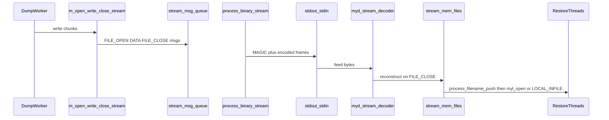

# Binary Streaming

## Background

A typical `mydumper` backup involves storing the backup to a local directory in a series of individual text files, one-per-table. When a restore is needed, `myloader` can read the files from this directory, and load the data into the database.

In some situations, the server may not have enough storage to hold the backup locally, even when compressed. This is where a streaming backup can help. Instead of writing the backup files locally, the files are written to stdout, which can be redirected to another server via tools like `ssh`, or `socat`. The backup files are still written to disk, temporarily, and are removed once received on the other end (based on configuration options).

Another useful scenario utilizing the streaming feature is replica creation. You can use `mydumper` to stream a backup directly to `myloader`. A major downside to this process is the loss of some multi-threaded loading capabilities. Backup files are first "staged" on the `mydumper` side, then transfered and re-staged on the `myloader` side, before being processed into the database.

To improve the overall multi-threaded streaming performance of `myloader`, and to remove any disk-related overhead on either side, a new streaming protocol has been created. Instead of needing to stage entire backup files to disk before transfering, the new method uses a multiplexed binary protocol (`MYDSTRM2`) that allows for interleaving multiple files over a single pipe.

This documentation page explains the legacy text framing, the new wire format (ie: the protocol), how a file travels from dump workers to restore threads, in-process compression, and the memory-budget controls.

## Legacy text streaming

The older stream format sent one completed file at a time using the following text-based "header" information:

```
\n-- <basename> <size>\n
<exactly size bytes of file content>
```

Notice that the size of the file is in the header contents, thus the filesize needed to be known before the file could be sent. To handle this, `mydumper` staged each file on disk to get the size (eg: `chunk-size` config parameter), built the header string, copied the file to stdout (ie: the stream), then deleted the file.

Concurrent dump workers could not truly interleave multiple files on the pipe: the stream writer handled one file, and callers waited on a per-file synchronous ACK (`done` queue in `stream_queue_push`) before continuing.

Compression could be performed on the backup files, however, this required launching a sub-process, and instructing gzip, or zstd to compress the on-disk file.

To recap, the legacy design struggled with parallel dumps:

- No multiplexing of concurrent workers over one pipe
- Extra disk I/O, and full-file staging before send
- Dump progress coupled to myloader via ACK
- Poor fit for diskless / high-parallel workloads

**NOTE:** The legacy system remains, and is used when `--exec-per-thread` is configured (eg: per-file encryption).

## Binary stream overview

The new streaming protocol replaces the text-based header with a binary-based one. At the start of each file, a [magic identifier,](https://en.wikipedia.org/wiki/File_format#Magic_number) `MYDSTRM2`, is used so multiplexed frames (ie: fragment of a larger file) can be open on the pipe at once. File size does not need to be known up front, so dump workers can stream buffers directly without staging data files on disk.

On the receiving side, `myloader` peeks the first eight bytes, and selects binary or legacy automatically.

### In-process "sink"

Dump workers normally open a file on disk, write, and close files through `m_open` / `m_write` / `m_close`. In streaming mode, those hooks are swapped to `m_open_stream` / `m_write_stream` / `m_close_stream` which create a "sink" (eg: memory location) that lives inside the mydumper process. Dump workers write to memory (optionally compressed) and are enqueued as protocol messages for the stdout writer thread, instead of being written to a real file on disk. Same basic functionality as legacy streaming, just a  different destination.

## Wire protocol

Multiplexing each backup file requires taking that data, and adding the header magic, along with some other metadata information.

### Example layout (one file)

Here is an overview of the byte stream for a small uncompressed file named `db.t.00000.sql`:

```
MYDSTRM2                                                # magic header
01 <stream_id> <filename_length> db.t.00000.sql 00 00   # FILE_OPEN frame, flags=NONE, codec=NONE
02 <stream_id> <len> <payload...>                       # DATA frame (repeats as needed)
02 <stream_id> <len> <payload...>                       # DATA frame
02 <stream_id> <len> <payload...>                       # DATA frame
02 <stream_id> <len> <payload...>                       # DATA frame
03 <stream_id> <total_size> 01 <crc32le>                # FILE_CLOSE frame, flags=Checksum, CRC32
04                                                      # EOF (after all files)
```

Several `stream_id`s may be interleaved: OPEN for A, DATA for B, DATA for A, CLOSE for B, and so on.

### Frame types

In the table below, you can see the frame types, their names, and the data contained in each frame's payload.


| Value | Name         | Payload                                                                   |
| ----- | ------------ | ------------------------------------------------------------------------- |
| 1     | `FILE_OPEN`  | varint `stream_id`, varint `name_len`, name bytes, `u8` flags, `u8` codec |
| 2     | `DATA`       | varint `stream_id`, varint `length`, `length` raw bytes                   |
| 3     | `FILE_CLOSE` | varint `stream_id`, varint `total_size`, `u8` flags, optional CRC32       |
| 4     | `EOF`        | no payload (end of entire stream)                                         |
| 5     | `CANCEL`     | no payload (dump user-cancel; normally followed by `EOF`)                 |


### Flags and codecs

Within the `FILE_OPEN` frame type, there are two bytes used to represent if the frame is compressed, or not, and if compressed, which compression type is used.

In `FILE_CLOSE` frames, there is 1 flag indicating if a CRC32 checksum follows in the next 4 bytes.

**FILE_OPEN flags**


| Value  | Name                        | Meaning                             |
| ------ | --------------------------- | ----------------------------------- |
| `0x00` | `MYD_FOPEN_FLAG_NONE`       | Uncompressed DATA                   |
| `0x01` | `MYD_FOPEN_FLAG_COMPRESSED` | DATA bytes are compressed per codec |


**Codecs** (`FILE_OPEN` codec byte; meaningful only when compressed)


| Value | Name                | Notes                |
| ----- | ------------------- | -------------------- |
| 0     | `MYD_CODEC_NONE`    | Uncompressed         |
| 1     | `MYD_CODEC_DEFLATE` | Raw zlib deflate     |
| 2     | `MYD_CODEC_GZIP`    | Gzip-wrapped deflate |
| 3     | `MYD_CODEC_ZSTD`    | libzstd stream       |


**FILE_CLOSE flags**


| Value  | Name                    | Meaning                                               |
| ------ | ----------------------- | ----------------------------------------------------- |
| `0x00` | `MYD_FCLOSE_FLAG_NONE`  | No CRC                                                |
| `0x01` | `MYD_FCLOSE_FLAG_CRC32` | Next 4 bytes are LE CRC32 of **uncompressed** content |


When a file is compressed, `FILE_CLOSE.total_size` and CRC describe the uncompressed content so the user can verify after decompressing.

## End-to-end lifecycle




1. **Dump.** Mydumper workers call `m_open_stream` / `m_write_stream` / `m_close_stream`. The first write may emit `FILE_OPEN`; subsequent writes enqueue `DATA`; close flushes any compressor and emits `FILE_CLOSE` with uncompressed size and CRC. Metadata may still be written to a temporary file and then framed via `stream_binary_push_file`.
2. **Encode.** `process_binary_stream` writes the magic once, pops messages from `stream_msg_queue`, encodes with `myd_stream_encode_`*, and writes to stdout. For large `DATA` frames it writes the header then the payload separately to avoid an extra copy.
3. **Stream.** Many logical files share one pipe, distinguished by `stream_id`.
4. **Decode.** myloader peeks for `MYDSTRM2`, then `process_binary_stream_loader` feeds stdin into `myd_stream_decoder`. Callbacks `demux_on_open` / `demux_on_data` / `demux_on_close` rebuild each file (decompressing when the flags say so).
5. **Restore.** Completed data files land in `stream_mem_files`. Loaders take them with `stream_mem_get` and restore via `fmemopen` (`myl_open`) or the LOCAL INFILE handler. Names starting with `metadata` are written under the work directory for GKeyFile parsing.

Shutdown ends with a `MYD_FRAME_EOF` message so myloader knows the stream is complete. If the dump is cancelled with Ctrl+C on the mydumper host, mydumper sends `MYD_FRAME_CANCEL` followed by `MYD_FRAME_EOF` so myloader can stop without a separate Ctrl+C on the restore host.

## Interrupting a stream (Ctrl+C)

Streaming works locally (`mydumper --stream | myloader --stream`) and remotely (often via `socat` over TCP). **myloader stdin is always the byte stream**, never the terminal — confirmation prompts must not read from stdin in `--stream` mode.

### Local pipe

```bash
mydumper --stream ... | myloader --stream ...
```

Both processes may receive SIGINT from the same terminal session. Each program handles Ctrl+C on its own host.

### Remote socat

```bash
# Dump host
mydumper --stream ... | socat - TCP:restore-host:9200

# Restore host
socat TCP-LISTEN:9200,reuseaddr,fork - | myloader --stream ...
```

Ctrl+C affects only the terminal where it was pressed.

### Dump host cancel (partial coordination)

When you confirm cancel on **mydumper**, it sends **`MYD_FRAME_CANCEL`** then **`MYD_FRAME_EOF`** on the stream. **myloader** sets shutdown, discards in-flight partial files leniently, drains restore workers, and exits — no restore-side Ctrl+C required. Requires matching mydumper/myloader versions.

### Restore host cancel

When you confirm cancel on **myloader**, the prompt uses **`/dev/tty`** (not stdin). myloader shuts down cleanly and does **not** write a `resume` file (resume is directory-restore only). The dump side eventually sees a broken pipe / disconnect and exits with a warning, not a fatal error.

Use **`myloader --kill-at-once`** to skip the Y/N confirmation on the restore host.

### Abrupt disconnect

If socat or the network fails mid-stream (no `CANCEL` / `EOF` frame), myloader treats truncated frames as a producer disconnect (warnings, no core dump). mydumper treats a closed consumer as **`Stream consumer disconnected; stopping dump`**.

## Compression

Enable with `mydumper -c/--compress [gzip|zstd]` (The default is **zstd** when `-c` is given without an argument).

Compression is performed on each "file", across DATA frames. Meaning, a single `DATA` frame is a slice of the compressed byte stream, not an independently decompressible unit. CRC and `total_size` on FILE_CLOSE are always over the uncompressed bytes.


| Codec                                 | Producer                                           | Consumer                               |
| ------------------------------------- | -------------------------------------------------- | -------------------------------------- |
| gzip (and bare/default when not zstd) | zlib `deflateInit2(..., 15+16)` → `MYD_CODEC_GZIP` | `inflateInit2(..., 15+32)` auto-detect |
| zstd                                  | libzstd `ZSTD_CStream` → `MYD_CODEC_ZSTD`          | `ZSTD_DStream`                         |


`myloader` no longer requires the `--compress` flag; it reads the codec from each `FILE_OPEN` metadata.

**NOTE:** `--exec-per-thread` is incompatible with `--compress` and forces the file-on-disk path, which disables the binary diskless sink. If you want to compress the files on disk, simply add the compression command to your exec-per-thread call.

### Multi-threaded zstd

An environment variable, `MYDUMPER_ZSTD_WORKERS`, sets `ZSTD_c_nbWorkers` when using file-on-disk backups (default 1 compression thread per open file). This offloads compression so a dump worker is not blocked on CPU for large on-disk files.

This variable is ignored for streaming, and uses a single-threaded in-process `ZSTD_CStream` / `ZSTD_DStream` so dump workers are not oversubscribed on the pipe path.

## Memory budget subsystem

There are two independent local memory "budgets"; one on mydumper, and one on myloader. The binary protocol has no ACK, in other words, there is no communication between the two programs.

### mydumper

On the `mydumper` side, workers enqueue multiplexed `DATA` frames without waiting for a per-file ACK from myloader, therefore, a separate budget on mydumper provides memory protection. Mydumper writes the values of the parameters `chunk-filesize`, and `stream-budget-mb` to the initial metadata file sent to myloader.

### myloader 

On the `myloader` side, after the streaming protocol receives an entire file, it is kept in RAM (`stream_mem_files`) instead of writing to disk. Without a memory limit, a fast receive thread could queue far more data in memory than loader threads can process into MySQL. By default, myloader's memory budget is 512MB.

Myloader calculates a recommended budget by comparing mydumper's budget / chunk size to the number of threads. If the budget on myloader is too small, a warning will be displayed, and the budget will be auto-size up. The user can override this behavior by setting an explicit `--stream-budget-mb` on myloader. A warning will still be displayed if there isn't enough budget to match the incoming stream.

Example: mydumper chunk-size=100MB, stream-budget-mb=256MB. myloader threads=8, stream-budget-mb=128MB. Recommended myloader budget: (128 / 100) = 1.28. This is how many effective threads myloader can process. Since this is less than 8, a warning is displayed, and the myloader budget is auto-scaled up to (8 * 100MB) = 800MB

### How it works

- On the mydumper side, each time a file is ready to be queued for streaming, "charge" the budget, which decrements the amount of remaining memory available to hold files.
- If the charge is successful, queue the file to be streamed. A "credit" is given back to the budget after each `DATA` payload is written to stdout.
- When the mydumper queue is non-empty, and if adding more bytes would exceed the capacity, the caller (eg: a dumper thread) blocks (`g_cond_wait`) until free space is available. Data is never dropped.
- Empty-queue exception: if the current charge to the budget is zero, a single unit larger than the capacity is allowed. This avoids self-deadlock when one file exceeds the budget. You should either increase the capacity, or lower the chunk-size to avoid this situation.
- On the myloader side, we charge the budget once at `FILE_CLOSE` (after receiving, and decompress/CRC), not per chunk. Schema and metadata files are exempt from the budget (they are typically < 1KB in size, and if they cannot be processed due to a maxed out budget, then myloader can self-deadlock).
- myloader credits back to its budget when a loader finishes (`myl_close` after `fmemopen`, or at LOCAL INFILE end). 
- At maximum budget, if demux (myloader) stops reading stdin (because its budget is full), the pipe fills and mydumper’s stdout writes will self-block (ie: pause). This creates a natural end-to-end backpressure.
- Legacy (non-binary) streaming still uses the per-file synchronous ACK path.

## Configuration quick reference


| Option / env                              | Role                                                                 |
| ----------------------------------------- | -------------------------------------------------------------------- |
| `mydumper --stream` / `myloader --stream` | Enable streaming; myloader auto-detects `MYDSTRM2` vs legacy         |
| `mydumper -c/--compress [gzip | zstd]`    | Compress intra-stream; default zstd                                  |
| `--exec-per-thread`                       | Custom external filter; disables diskless stream                     |
| `MYDUMPER_ZSTD_WORKERS`                   | On-disk zstd worker threads only (default 1); not used by `--stream` |


`--outputdir` with mydumper `--stream`, and `--directory` with myloader `--stream`, are now invalid when used together.